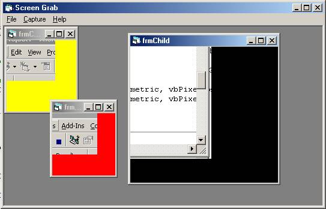

## ScreenGrab\- jpg/bmp

### Description

Grab section of screen/desktop. Can save as jpg or bmp. Needs ijl5.dll from http://developer.intel.com/software/products/perflib/ijl/index.htm in windows\system folder.
 
### More Info
 

             |
---                |---
**Submitted On**   |2001-06-09 12:39:54
**By**             |[oigres P](https://github.com/Planet-Source-Code/PSCIndex/blob/master/ByAuthor/oigres-p.md)
**Level**          |Advanced
**User Rating**    |5.0 (10 globes from 2 users)
**Compatibility**  |VB 5\.0, VB 6\.0
**Category**       |[Complete Applications](https://github.com/Planet-Source-Code/PSCIndex/blob/master/ByCategory/complete-applications__1-27.md)
**World**          |[Visual Basic](https://github.com/Planet-Source-Code/PSCIndex/blob/master/ByWorld/visual-basic.md)
**Archive File**   |[ScreenGrab209576102001\.zip](https://github.com/Planet-Source-Code/oigres-p-screengrab-jpg-bmp__1-23960/archive/master.zip)

